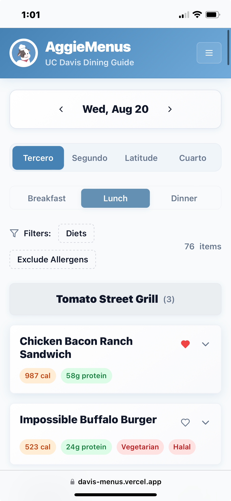
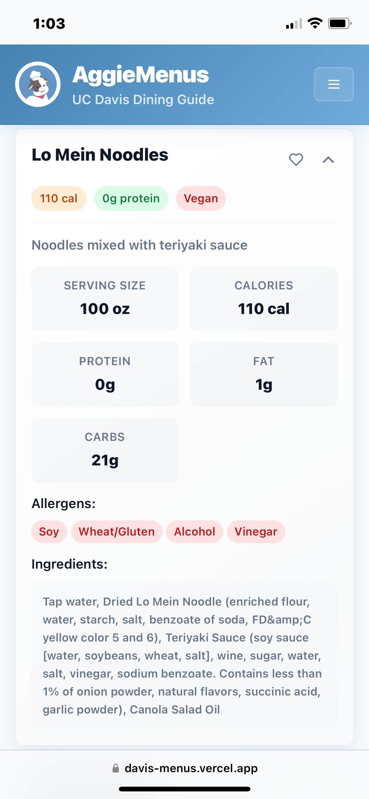
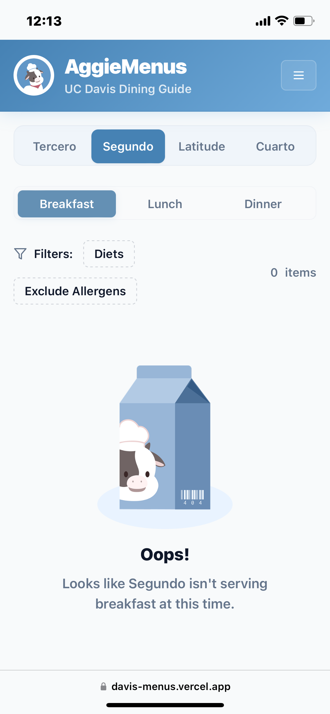
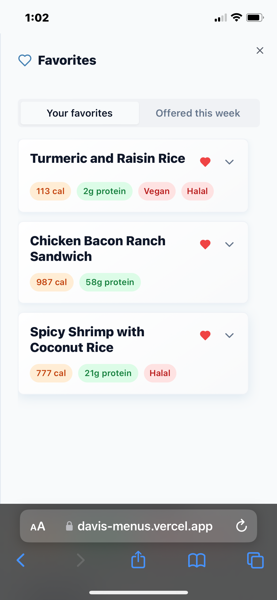
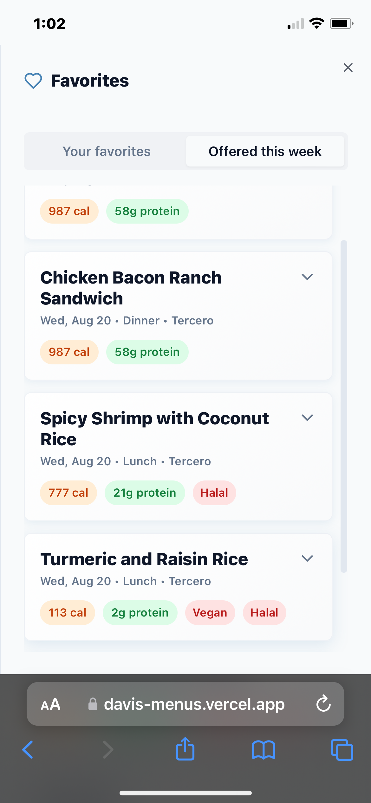
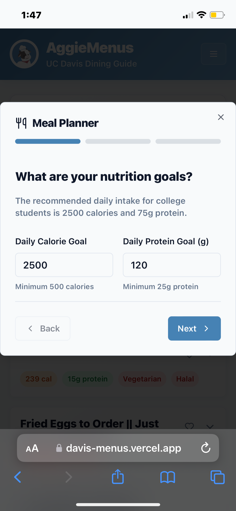
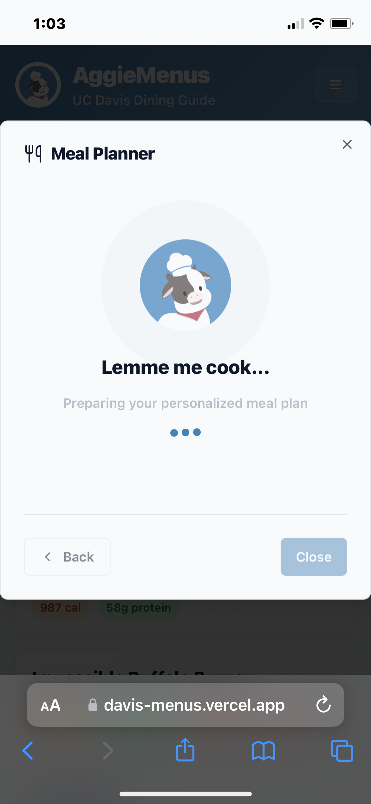
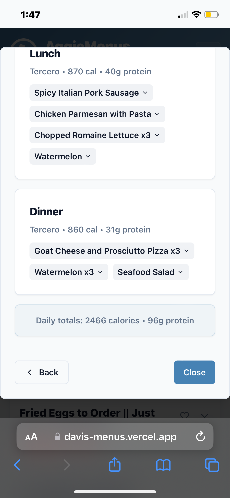
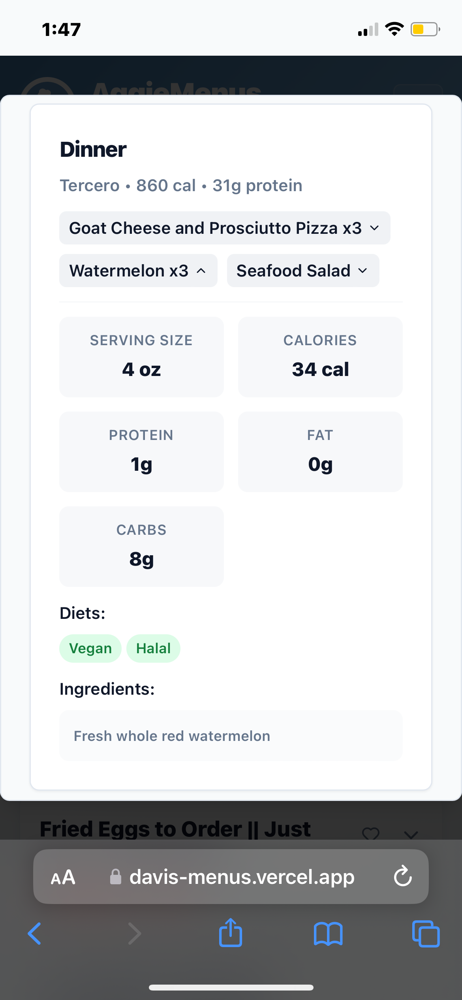

A remake of AggieMenus with a brand new design and meal planner that suggests healthy meals
to help users hit protein and calorie goals.

## Key Features
- Meal planner (NEW)
- Brand new design
- Mobile friendly
- Favorite foods tracker

## Screenshots

| Home | Menu Item | Empty Menu |
|--------------|--------------|--------------|
||||

| Favorites | Offered This Week | Meal Planner |
|--------------|--------------|--------------|
||||

| Loading Animation | Meal Plan | Meal Plan Expanded |
|--------------|--------------|--------------|
||||